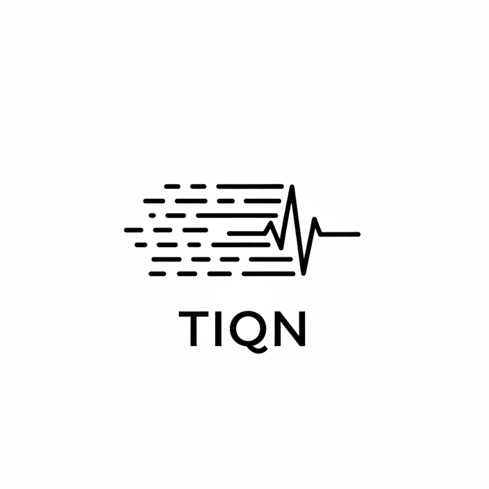

# Tiqn - Cada segundo cuenta



## Overview

Tiqn is an intelligent emergency response system designed for Chile's legacy 911 infrastructure. It modernizes emergency call handling by automatically extracting critical information from phone conversations and coordinating rescue operations in real-time.

## The Problem

Traditional emergency services rely on manual data entry during high-stress situations, leading to:
- Delays in extracting critical information
- Human error in recording locations and details
- Inefficient coordination between dispatchers and first responders
- Lost time that could mean the difference between life and death

## Our Solution

Tiqn leverages AI and modern technology to bridge the gap between legacy phone systems and digital emergency response:

### Core Features

1. **AI-Powered Call Transcription**: Real-time transcription and analysis of emergency calls using Twilio streams
2. **Automatic Information Extraction**: Intelligent parsing of location, incident type, and victim details
3. **Real-Time Coordination**: Live map-based dispatch system connecting operators and rescuers
4. **Mobile Rescuer App**: Native iOS/Android app with GPS tracking and incident navigation
5. **Web Dashboard**: Operator interface for monitoring active incidents and managing responses

## Tech Stack

### Backend (`tiqn_backend`)
- **FastAPI**: High-performance API server
- **Twilio Media Streams**: Real-time audio streaming from phone calls
- **AI Integration**: Automatic transcription and data extraction
- **CORS-enabled**: Supports web and mobile clients

### Frontend (`tiqn-nextjs`)
- **Next.js 15**: React framework with server components
- **Tailwind CSS**: Modern, responsive UI
- **Twilio Voice SDK**: Call handling and routing
- **Convex**: Real-time database synchronization
- **TypeScript**: Type-safe development

### Mobile App (`tiqn-expo`)
- **Expo**: Cross-platform React Native development
- **React Native Maps**: Location tracking and navigation
- **LiveKit**: Real-time audio communication
- **ElevenLabs**: Voice AI integration
- **GPS Integration**: Real-time location tracking for rescuers

## Project Structure

```
platanus-hack-25-team-22/
├── tiqn_backend/          # FastAPI backend
│   └── core_api/          # Emergency processing API
├── tiqn-nextjs/           # Web dashboard
│   └── src/               # Next.js application
└── tiqn-expo/             # Mobile rescuer app
    └── app/               # Expo Router pages
```

## Getting Started

### Backend
```bash
cd tiqn_backend/core_api
pip install -r requirements.txt
uvicorn src.main:app --reload
```

### Web Dashboard
```bash
cd tiqn-nextjs
pnpm install
pnpm dev
```

### Mobile App
```bash
cd tiqn-expo
npm install
npx expo start
```

## Team

**team-22** - Platanus Hack 2025

- Diego Pollack ([@DiegoPollack](https://github.com/DiegoPollack))
- Fernando Smith ([@fernandosmither](https://github.com/fernandosmither))
- Marco Gómez ([@MarcoNaik](https://github.com/MarcoNaik))
- Alister MacCormack ([@a-maccormack](https://github.com/a-maccormack))
- Daniel Sateler ([@satelerd](https://github.com/satelerd))

## Track

☎️ **Legacy** - Modernizing Chile's emergency phone infrastructure

## Impact

By automating information extraction and enabling real-time coordination, Tiqn reduces emergency response times and improves outcomes when every second counts.
